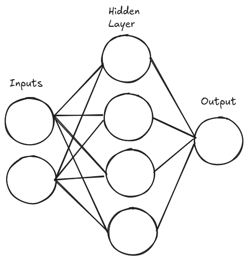
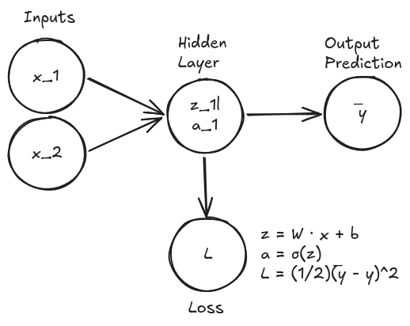
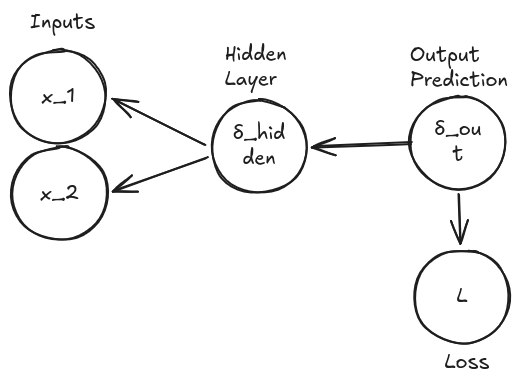

I recently built a feedforward neural network from scratch in [Luma](https://luma-website-mu.vercel.app/), my own compiled systems language. No ML libraries, no Python, no frameworks. Just weights, matrix math, and sigmoid (modern neural networks use ReLU). Here's how it works under the hood.

## Architecture

The network is a simple fully connected feedforward design:



Two input nodes, four hidden nodes, one output. The layers are represented as a doubly linked list of `Layer` structs, which lets me traverse forward during the forward pass and backward during backpropagation:

```
null ← input_layer ⇄ hidden_layer ⇄ output_layer → null
```

Each `Layer` holds its own weights, biases, pre-activation values (`z`), post-activation outputs (`a`), error deltas, and weight gradients, along with the `prev` and `next` pointers to walk the chain.

## Weight Initialization

Weights are initialized using **Xavier initialization**: random values in the range of `±sqrt(6 / (num_inputs + num_outputs))`. This keeps the gradients from vanishing or exploding as they propagate through the network. Without it, deeper networks either saturate (all nodes fire at 1) or die (all nodes fire at 0). The biases start at `0.0`.

## Forward Pass



For each layer there are two steps. The first is to compute the pre-activation `z` by taking the dot product of the inputs with the weights and adding the bias:

```
z[j] = bias[j] + sum(inputs[i] * weights[i * num_outputs + j])
```

Then squash `z` through the sigmoid activation function to get `a`:

```
a[j] = sigmoid(z[j]) = 1 / (1 + e^(-z[j]))
```

Sigmoid maps any real value to the range of `(0, 1)`, modeling how a real neuron fires: off near 0, on near 1, with a smooth transition in between.

```
z = -5  →  sigmoid ≈ 0.007
z =  0  →  sigmoid = 0.500
z =  5  →  sigmoid ≈ 0.993
```

The output `a` of each layer becomes the input to the next, propagating all the way through the network.

## Backpropagation


 
This is where the real magic happens. The forward pass tells us what the network predicted; backpropagation tells us who's to blame. It works backwards from the output, applying the chain rule at every layer to figure out how much each individual weight contributed to the error.
 
The thing that carries this "blame" backwards through the network is called the delta. One error signal per node, representing how much that node's output needs to change to reduce the overall loss. Once we have a delta for a layer, the weight gradients for that layer fall out almost for free. So the real question is just: how do we compute delta?
 
**At the output layer**, it's straightforward, because we have something to compare against the target:
 
```
delta[j] = (output[j] - target[j]) * sigmoid'(z[j])
```
 
This is the raw prediction error, scaled by how sensitive the sigmoid is at that point. And here's a nice shortcut: since `sigmoid'(z) = sigmoid(z) * (1 - sigmoid(z))`, and we already have `outputs = sigmoid(z)` sitting in memory from the forward pass, the derivative is free! No need to recompute anything. Just `outputs[j] * (1 - outputs[j])`.
 
**At a hidden layer**, there's no target to compare against; a hidden node doesn't know what its "correct" output should have been. So instead, it borrows the error from the layer ahead of it:
 
```
delta[i] = sum(next.weights[i][j] * next.delta[j]) * sigmoid'(z[i])
```
 
Each hidden node looks at every connection going forward, asks "how much did I contribute to the next layer's error, weighted by how strongly I'm connected to it?", and sums that up. This is exactly where the doubly linked list earns its keep: each hidden layer reaches into `next.weights` and `next.deltas` to pull this information backwards, one layer at a time, until every node in the network has its own delta.
 
With delta computed at every layer, the weight gradients are now almost trivial: they're just the product of the input that fed into a connection and the delta on the other end of it:
 
```
grad_w[i][j] = inputs[i] * delta[j]
```
 
That's the whole backward pass: propagate delta from output to input, then read off gradients along the way.
 
## Gradient Descent
 
Once we know the gradient, we can nudge each weight in the direction that reduces the error:
 
```
weights[i][j] -= learning_rate * grad_w[i][j]
biases[j]     -= learning_rate * delta[j]
```
 
The learning rate controls the step size. Too large and you overshoot the minimum. Too small and training takes forever. I settled on `0.1` for the logic gate tasks.

## Training Loop

The training repeats the forward pass, backward pass, and weight update over 200,000 **epochs**:

```
for each epoch:
    for each training example (input, target):
        run_forward(head, input)
        run_backward(output, target)
        run_update(head, input, lr)
    compute and log average loss
```

Here is the Luma code for a single epoch:

```rust
const train_epoch -> fn (
    head: *Layer,
    output_layer: *Layer,
    gate_inputs: [[double; 2]; 4],
    targets: *double,
    learning_rate: double
) void {
    loop [i: int = 0](i < 4) : (++i) {
        layer::run_forward(head, &gate_inputs[i][0]);
        layer::run_backward(output_layer, &targets[i]);
        layer::run_update(head, &gate_inputs[i][0], learning_rate);
    }
}
```

And the full training routine that builds the network, trains it, and saves the result:

```rust
const train_gate -> fn (
    gate_inputs: [[double; 2]; 4],
    targets: *double,
    save_path: *byte,
    input_size: int,
    hidden_size: int,
    output_size: int
) void {
    let hidden:       Layer = layer::init_layer(input_size, hidden_size);
    let output_layer: Layer = layer::init_layer(hidden_size, output_size);
    defer { layer::free_layer(&hidden); }

    hidden.init_weights_biases();
    output_layer.init_weights_biases();
    hidden.next = &output_layer;
    layer::link_layers(&hidden);

    let learning_rate: double = 0.1;
    let epochs: int = 200000;

    loop [epoch: int = 0](epoch < epochs) : (++epoch) {
        train_epoch(&hidden, &output_layer, gate_inputs, &targets[0], learning_rate);
    }

    layer::save_weights(&hidden, save_path);
}
```

This is called once per gate, with `hidden_size` set to 4:

```rust
train_gate(gate_inputs, &xor_targets[0], "saved_weights/xor.bin", 2, 4, 1);
```

## Results: Learning Logic Gates

To test the network, I trained it on five logic gates: AND, NAND, OR, NOR, and XOR. All of them are 2-input to 1-output problems. XOR is the interesting one because it's **not linearly separable**. This means a single layer can't solve it. You need to have a hidden layer.

After 200,000 epochs at learning rate `0.1`, here's what the XOR results look like:

```
[0.0, 0.0] → 0.001343   (target: 0)
[0.0, 1.0] → 0.996737   (target: 1)
[1.0, 0.0] → 0.996696   (target: 1)
[1.0, 1.0] → 0.004978   (target: 0)
```

All five gates pass:

```
╔══════╦════════╦════════╦════════╦════════╦════════╗
║ A  B ║  AND   ║  NAND  ║   OR   ║  NOR   ║  XOR   ║
╠══════╬════════╬════════╬════════╬════════╬════════╣
║ 0  0 ║    0   ║    1   ║    0   ║    1   ║    0   ║
║ 0  1 ║    0   ║    1   ║    1   ║    0   ║    1   ║
║ 1  0 ║    0   ║    1   ║    1   ║    0   ║    1   ║
║ 1  1 ║    1   ║    0   ║    1   ║    0   ║    0   ║
╚══════╩════════╩════════╩════════╩════════╩════════╝
```

## Persistence

The trained weights are saved to binary files. Each layer writes a header (`num_inputs`, `num_outputs`) followed by raw `double` arrays. Loading them back means we can skip the training loop entirely:

```rust
layer::load_weights(&hidden, "xor.bin");  // ready to predict
```

## Why Do This in Luma?

Writing a neural network in a low-level compiled language instead of Python taught me a lot. There are more things you have to consider, like: the memory layout (flattened matrices in row-major order), manual heap allocations with alloc/free, pointer-based data structures (the linked list of layers), and the numerical stability (clamping sigmoid input to avoid float overflow). As to why... why not! It's a fun experience and it challenges the language, so I can find errors and weird edge cases.

The full source is on [GitHub](https://github.com/TheDevConnor/Neural_Net) if you want to see the implementation.